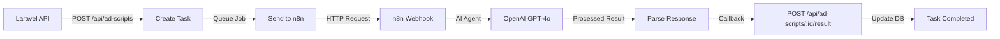

# n8n AI Agents Integration with Laravel

This project demonstrates the integration between a Laravel application and n8n AI Agents for automated advertising script refactoring. The marketing team can submit scripts for analysis and improvement, and the system automatically processes them using AI.

## Architecture



## Features

### Core Functionality
- **F-1**: API endpoint `POST /api/ad-scripts` accepts JSON with `reference_script` and `outcome_description`
- **F-2**: Laravel triggers n8n webhook via queued job
- **F-3**: n8n workflow uses AI Agent to analyze and generate improved scripts
- **F-4**: Callback endpoint `POST /api/ad-scripts/{id}/result` receives results from n8n
- **F-5**: Error handling with status tracking (pending, completed, failed)

### Professional Enhancements
- **API Resources** - Consistent JSON response formatting
- **Event-Driven Architecture** - Events and Listeners for better separation of concerns
- **Rate Limiting** - Configurable rate limiting middleware
- **API Key Authentication** - Secure callback endpoint with API key validation
- **Comprehensive Logging** - Detailed logging for all operations
- **Health Check Endpoint** - System health and statistics endpoint
- **Advanced Error Handling** - Graceful error handling with retry logic
- **Search & Filtering** - Search and filter tasks by status
- **Pagination** - Efficient pagination with configurable limits
- **Comprehensive Tests** - Full test coverage including edge cases

## Quick Start

### Prerequisites

- PHP 8.2+
- Composer
- Node.js & npm
- SQLite (or MySQL)
- n8n instance (self-hosted or cloud)

### Installation

1. **Clone the repository**
   ```bash
   git clone <repository-url>
   cd n8n-AI
   ```

2. **Install dependencies**
   ```bash
   composer install
   npm install
   ```

3. **Configure environment**
   ```bash
   cp .env.example .env
   php artisan key:generate
   ```

4. **Configure n8n settings in `.env`**
   ```env
   N8N_WEBHOOK_URL=https://your-n8n-instance.com/webhook/ad-script-refactor
   N8N_API_KEY=your-n8n-api-key-here
   ```
   
   **Note:** If using Docker Compose, these will be set automatically. For local development, update them with your n8n instance URL.

5. **Run migrations**
   ```bash
   php artisan migrate
   ```

6. **Start the queue worker** (in a separate terminal)
   ```bash
   php artisan queue:work
   ```

7. **Start the development server**
   ```bash
   php artisan serve
   ```

### Docker Compose Setup (Optional)

A `docker-compose.yml` file is provided for easy setup:

```bash
docker-compose up -d
```

This will start:
- Laravel app on port 8000
- MySQL database
- n8n on port 5678

## n8n Workflow Setup

1. **Import the workflow**
   - Open your n8n instance
   - Go to Workflows → Import from File
   - Select `n8n-workflow.json`

2. **Configure OpenAI credentials**
   - In the AI Agent node, add your OpenAI API credentials
   - Ensure you have an OpenAI API key with access to GPT-4o

3. **Activate the workflow**
   - Click "Active" toggle to activate the workflow
   - Copy the webhook URL and update `N8N_WEBHOOK_URL` in your `.env`

4. **Test the workflow**
   - Use the webhook test feature in n8n or send a test request from Laravel

## Testing

Run the test suite:

```bash
php artisan test
```

Run specific test files:

```bash
php artisan test tests/Feature/Api/AdScriptTest.php
php artisan test tests/Feature/Jobs/SendAdScriptToN8nTest.php
```

## API Endpoints

### Create Ad Script Task

```bash
POST /api/ad-scripts
Content-Type: application/json

{
  "reference_script": "Your original advertising script here...",
  "outcome_description": "Make it more engaging and target young adults aged 18-25."
}
```

**Response:**
```json
{
  "message": "Task created successfully",
  "task_id": 1,
  "status": "pending"
}
```

### Get Task Details

```bash
GET /api/ad-scripts/{id}
```

**Response:**
```json
{
  "task": {
    "id": 1,
    "reference_script": "...",
    "outcome_description": "...",
    "new_script": "...",
    "analysis": "...",
    "status": "completed",
    "created_at": "2025-12-09T12:00:00.000000Z",
    "updated_at": "2025-12-09T12:05:00.000000Z"
  }
}
```

### List All Tasks

```bash
GET /api/ad-scripts?per_page=15
```

### Callback Endpoint (used by n8n)

```bash
POST /api/ad-scripts/{id}/result
Content-Type: application/json

{
  "new_script": "Improved script generated by AI...",
  "analysis": "Analysis of changes made..."
}
```

## Sample cURL Requests

### Create a task

```bash
curl -X POST http://localhost:8000/api/ad-scripts \
  -H "Content-Type: application/json" \
  -d '{
    "reference_script": "Buy our amazing product today! Limited time offer. Call now!",
    "outcome_description": "Make it more professional and appeal to B2B customers. Focus on value proposition."
  }'
```

### Check task status

```bash
curl http://localhost:8000/api/ad-scripts/1
```

### List all tasks

```bash
curl http://localhost:8000/api/ad-scripts
```

## Postman Collection

A Postman collection is included in `postman_collection.json` for easy API testing. Import it into Postman to get started quickly.

**To import:**
1. Open Postman
2. Click Import
3. Select `postman_collection.json`
4. Update the `base_url` variable if needed (default: `http://localhost:8000`)

## Security

- **API Key Authentication**: Callback endpoint (`POST /api/ad-scripts/{id}/result`) requires `X-N8N-API-KEY` header
- **Rate Limiting**: Configurable rate limiting (default: 60 requests/minute) for task creation
- **Input Validation**: All inputs validated via Form Request classes
- **Environment Variables**: Sensitive configuration stored in `.env`
- **SQL Injection Protection**: Eloquent ORM prevents SQL injection
- **XSS Protection**: Laravel's built-in XSS protection
- **CSRF Protection**: Enabled for web routes (API routes excluded by default)

**Production Recommendations:**
- Add authentication middleware for all API endpoints
- Implement HMAC signature validation for enhanced security
- Use HTTPS in production
- Rotate API keys regularly
- Monitor rate limit violations

## 🗄️ Database Schema

### `ad_script_tasks` table

| Column | Type | Description |
|--------|------|-------------|
| id | bigint | Primary key |
| reference_script | text | Original script to be improved |
| outcome_description | text | Desired outcome/requirements |
| new_script | text (nullable) | Generated improved script |
| analysis | text (nullable) | AI analysis of changes |
| status | string | pending, completed, or failed |
| error_details | text (nullable) | Error message if failed |
| created_at | timestamp | Creation timestamp |
| updated_at | timestamp | Last update timestamp |

## Queue Configuration

The application uses Laravel's queue system for asynchronous processing. Jobs are dispatched when a task is created and handle communication with n8n.

**Queue Configuration:**
- Driver: `sync` (default for development)
- For production, configure Redis or database queue driver
- Job retries: 3 attempts with 30-second backoff

## Error Handling

- Failed jobs automatically update task status to `failed`
- Error details are stored in `error_details` field
- Timeout handling: 120 seconds for n8n requests
- Retry mechanism: 3 attempts with exponential backoff

## Monitoring

- Check queue status: `php artisan queue:work --verbose`
- View failed jobs: `php artisan queue:failed`
- Retry failed jobs: `php artisan queue:retry {job-id}`

## Documentation

- **[API Documentation](API_DOCUMENTATION.md)** - Complete API reference with examples
- **[Postman Collection](postman_collection.json)** - Import ready Postman collection
- **[n8n Workflow](n8n-workflow.json)** - Production-ready n8n workflow with error handling

## Front-End Interface

The application includes a beautiful front-end interface built with Livewire Volt and Flux UI:

- **Task List Page** (`/ad-scripts`) - View all tasks with search and filtering
- **Task Details Page** (`/ad-scripts/{id}`) - View complete task details
- **Create Task Page** (`/ad-scripts/create`) - Submit new tasks via web interface
- **Real-time Updates** - Auto-refresh for pending tasks (polling every 5 seconds)

### Features:
- Beautiful UI with Flux UI components
- Search and filter functionality
- Real-time status updates
- Responsive design
- Dark mode support

## Slack Notifications

Failed tasks automatically send notifications to Slack:

1. **Configure Slack Webhook** in `.env`:
   ```env
   SLACK_WEBHOOK_URL=https://hooks.slack.com/services/YOUR/WEBHOOK/URL
   ```

2. **Notifications include:**
   - Task ID and status
   - Error message
   - Reference script preview
   - Direct link to view task

3. **Notifications are queued** - Won't block task processing

## License

MIT License

## Author

**Ivaylo Borisov**
- Email: ivaylo@borisov.eu

## Contributing

Contributions are welcome! Please feel free to submit a Pull Request.

